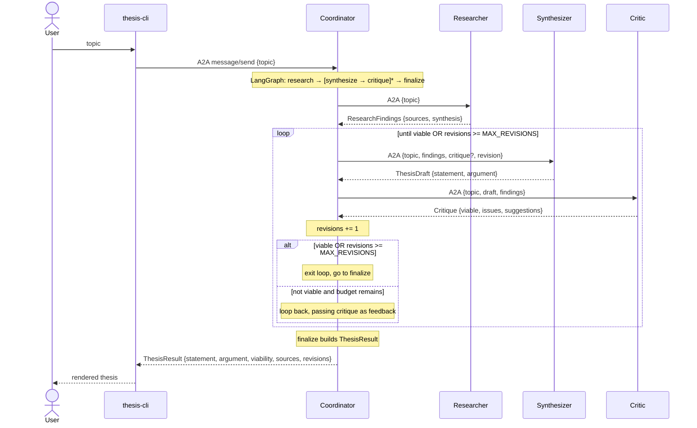
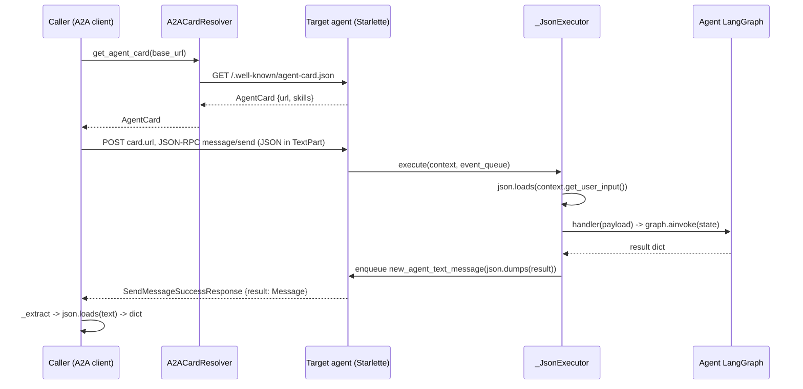
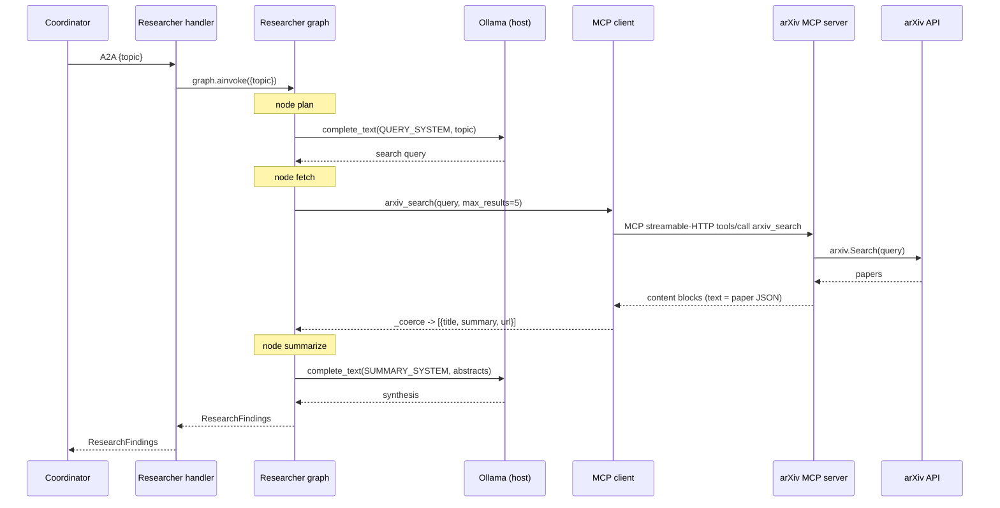
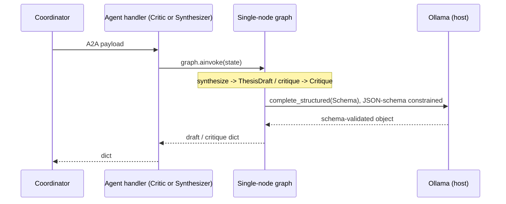
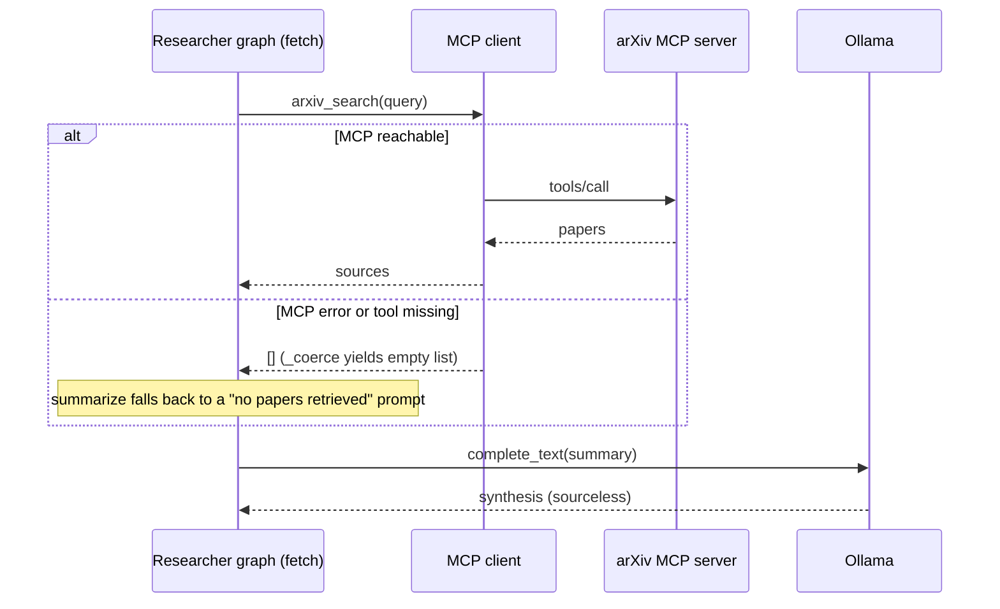

# a2a-langgraph — thesis multi-agent system

A coordinator-pattern multi-agent system that turns a research topic into a
**reasoned, viability-checked research thesis**. Each agent is its own LangGraph
graph and its own Docker image. Agents talk over **A2A**; the researcher reaches
arXiv through an **MCP** server. All LLM inference runs against **Ollama on the
host** (`llama3.1:8b`).

```
 CLI ──A2A──▶ Coordinator ──A2A──▶ Researcher ──MCP──▶ arXiv MCP server ──▶ arXiv
                  │  ▲
                  ├──A2A──▶ Synthesizer        (Researcher / Critic / Synthesizer
                  └──A2A──▶ Critic              run inference against host Ollama)

 Coordinator flow:  research (once) ─▶ [ synthesize ─▶ critique ]*
 Loop repeats while the Critic rejects viability, up to MAX_REVISIONS.
```

## Prerequisites

- **Docker** + Docker Compose
- **Ollama** running on the host at `0.0.0.0:11434` with the model pulled:
  ```bash
  ollama pull llama3.1:8b
  ```
- **uv** (only needed to run the CLI / tests on the host): https://docs.astral.sh/uv/

## Quickstart

```bash
cp .env.example .env          # optional; sensible defaults are baked in
docker compose up --build     # starts mcp_arxiv + 4 agents

# in another terminal, ask for a thesis (CLI runs on the host):
uv run thesis-cli "efficient retrieval-augmented generation for code"
```

The CLI sends the topic to the coordinator's A2A endpoint (`http://localhost:9000`)
and prints the thesis, its viability verdict, and the arXiv sources used.

## Local run without Docker

Each service reads its config from the environment, so you can run them as plain
processes (point everything at `localhost` instead of compose service names):

```bash
OLLAMA_BASE_URL=http://localhost:11434 MCP_ARXIV_URL=http://localhost:8000/mcp \
PORT=8000 uv run python -m mcp_arxiv.server &
PORT=8081 PUBLIC_URL=http://localhost:8081 uv run python -m researcher &
PORT=8082 PUBLIC_URL=http://localhost:8082 uv run python -m critic &
PORT=8083 PUBLIC_URL=http://localhost:8083 uv run python -m synthesizer &
PORT=9000 PUBLIC_URL=http://localhost:9000 \
  RESEARCHER_URL=http://localhost:8081 CRITIC_URL=http://localhost:8082 \
  SYNTHESIZER_URL=http://localhost:8083 uv run python -m coordinator &

uv run thesis-cli "your topic here"
```

## Layout

```
packages/
  common/            shared schemas, config, LLM factory, A2A server/client helpers
  agent_coordinator/ orchestration graph + A2A server + A2A clients to peers
  agent_researcher/  graph + A2A server + MCP client (arXiv)
  agent_critic/      graph + A2A server
  agent_synthesizer/ graph + A2A server
  mcp_arxiv/         MCP server exposing an `arxiv_search` tool
  cli/               thin A2A client (runs on host)
```

## Sequence diagrams

These are layered: diagram **1** treats each agent call as a single logical hop;
diagram **2** expands what *one* hop actually does; diagram **3** zooms into one
agent's internals (MCP + Ollama). The rest cover the remaining shapes.

### 1. End-to-end orchestration (with the refine loop)



### 2. Anatomy of a single A2A hop



### 3. Researcher internals (LangGraph + MCP + Ollama)



### 4. Critic / Synthesizer internals (structured output)



### 5. Startup and dependency ordering

```mermaid
sequenceDiagram
    participant DC as docker compose
    participant MX as mcp_arxiv
    participant R as agent_researcher
    participant S as agent_synthesizer
    participant C as agent_critic
    participant CO as agent_coordinator

    DC->>MX: start
    MX-->>DC: serving :8000/mcp
    par researcher (depends_on mcp_arxiv)
        DC->>R: start, serve card :8080
    and synthesizer
        DC->>S: start, serve card :8080
    and critic
        DC->>C: start, serve card :8080
    end
    DC->>CO: start (depends_on the three specialists)
    CO-->>DC: serving :8080, published to host :9000
    Note over DC,CO: depends_on waits for container start, not readiness;<br/>A2A cards are resolved lazily on first request
```

### 6. Failure path (arXiv MCP unavailable)



> Coordinator-level failures (a peer timing out past `call_agent`'s 300s budget)
> propagate up as an error in the MVP — graceful degradation there is a hardening task.

## Configuration

| Variable | Default | Used by |
|---|---|---|
| `OLLAMA_BASE_URL` | `http://host.docker.internal:11434` | all agents |
| `LLAMA_MODEL` | `llama3.1:8b` | all agents |
| `MAX_REVISIONS` | `2` | coordinator |
| `MCP_ARXIV_URL` | `http://mcp_arxiv:8000/mcp` | researcher |
| `RESEARCHER_URL` / `CRITIC_URL` / `SYNTHESIZER_URL` | compose service URLs | coordinator |
| `PUBLIC_URL` / `PORT` | per service | each agent |

## Tests

```bash
uv run pytest          # deterministic unit tests (no network, no LLM)
```

## Notes

- **Python is pinned to 3.12** across the workspace and images for LangChain /
  LangGraph / a2a-sdk compatibility, even though the host may run a newer version.
- **`a2a-sdk` is pinned to `0.3.26`** (classic Starlette + Pydantic API). The
  `1.0.x` line is a protobuf/gRPC redesign with a different surface.
- This is an **MVP**: timeouts are basic, there's no auth/observability, and task
  state is in-memory. Those are the hardening phase.
```
